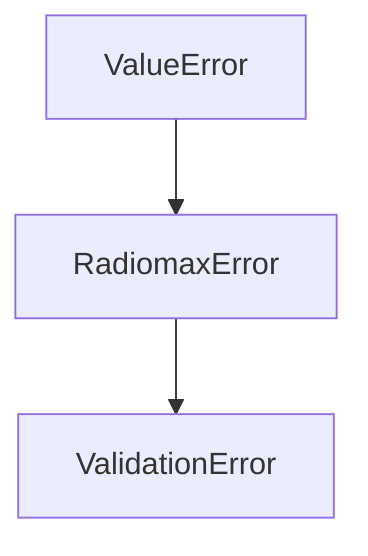

# Exceptions

Every error raised by the package derives from [`RadiomaxError`][radiomax.RadiomaxError], which is itself a `ValueError`.

```mermaid
graph TD
    V[ValueError] --> R[RadiomaxError]
    R --> A[ValidationError]
```

::: radiomax.exceptions
